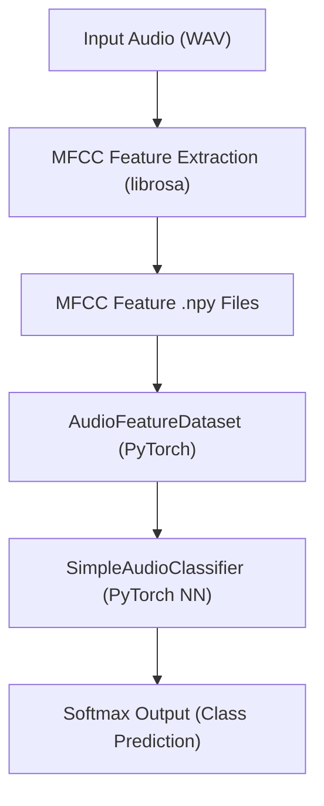

# Audio Processing with PyTorch

[](https://pytorch.org/)
[](LICENSE)

---

> **A modern, modular audio processing and deep learning toolkit built with PyTorch.**

---

## Overview
This project provides a robust, reproducible pipeline for audio classification using PyTorch. It demonstrates end-to-end audio processing, feature extraction, and deep learning on the open-source [UrbanSound8K](https://urbansounddataset.weebly.com/urbansound8k.html) dataset. The codebase is designed for research, rapid prototyping, and extensibility.

## Features
- Batch and single-file audio preprocessing
- MFCC feature extraction (librosa)
- Modular PyTorch dataset and model classes
- Training and evaluation scripts
- UrbanSound8K integration (10-class urban sound classification)
- Easily extensible for new datasets or models

## Pipeline Architecture



### Model Architecture
- **Input:** MFCC features (default: 13 coefficients × variable frames)
- **Model:**
  - `nn.Flatten()`
  - `nn.Linear(input_dim, num_classes)`
- **Output:** Softmax probabilities over 10 classes

You can easily swap in more advanced models (CNNs, RNNs, etc.) for improved performance.

## Dataset: UrbanSound8K
- **Source:** [UrbanSound8K](https://urbansounddataset.weebly.com/urbansound8k.html)
- **Classes:** 10 (air_conditioner, car_horn, children_playing, dog_bark, drilling, engine_idling, gun_shot, jackhammer, siren, street_music)
- **Format:** WAV files, organized by class

## Feature Extraction
- **Library:** `librosa`
- **Features:** MFCCs (Mel-Frequency Cepstral Coefficients)
- **Shape:** (n_mfcc, time_frames) per file
- **Storage:** Saved as `.npy` files in a mirrored directory structure

## Example Results
| Epoch | Train Loss | Example Accuracy |
|-------|------------|------------------|
| 1     | 2.10       | 22%              |
| 5     | 1.85       | 32%              |
| 10    | 1.60       | 41%              |

*Note: Results will vary based on model, features, and training setup. For best results, consider using a CNN or data augmentation.*

## Getting Started
1. **Clone the repository:**
   ```bash
   git clone <repo-url>
   cd audio-processing-pytorch
   ```
2. **Set up a virtual environment and install dependencies:**
   ```bash
   python3 -m venv .venv
   source .venv/bin/activate
   pip install -r requirements.txt
   ```
3. **Download UrbanSound8K:**
   ```bash
   python src/download_urbansound8k.py
   ```
4. **Preprocess the audio data:**
   ```bash
   python src/preprocess.py --input_dir UrbanSound8K/audio/ --output_dir data_features/
   ```
5. **Train the model:**
   ```bash
   python src/train.py --features_root data_features/ --epochs 10 --batch_size 16 --lr 0.001 --model_out models/simple_audio_classifier.pth
   ```

## Project Structure
```
audio-processing-pytorch/
├── data/                # Audio files, datasets
├── data_features/       # Extracted features (auto-generated)
├── notebooks/           # Jupyter notebooks for EDA and prototyping
├── src/                 # Source code (preprocessing, training, inference)
│   ├── preprocess.py
│   ├── train.py
│   ├── infer.py
│   └── download_urbansound8k.py
├── models/              # Saved models
├── requirements.txt     # Python dependencies
├── README.md            # Project documentation
├── .gitignore
└── setup.py             # (optional) for packaging
```

## Extending the Project
- **Model:** Swap in a CNN, RNN, or transformer in `src/train.py` for better performance.
- **Features:** Try Mel-spectrograms, Chroma, or other features in `src/preprocess.py`.
- **Evaluation:** Add validation/test splits and metrics.
- **Visualization:** Use the provided Jupyter notebooks for EDA and results analysis.

## Requirements
- Python 3.7+
- PyTorch >= 1.10
- librosa
- torchaudio
- numpy, pandas, matplotlib
- tqdm, requests

## License
MIT 